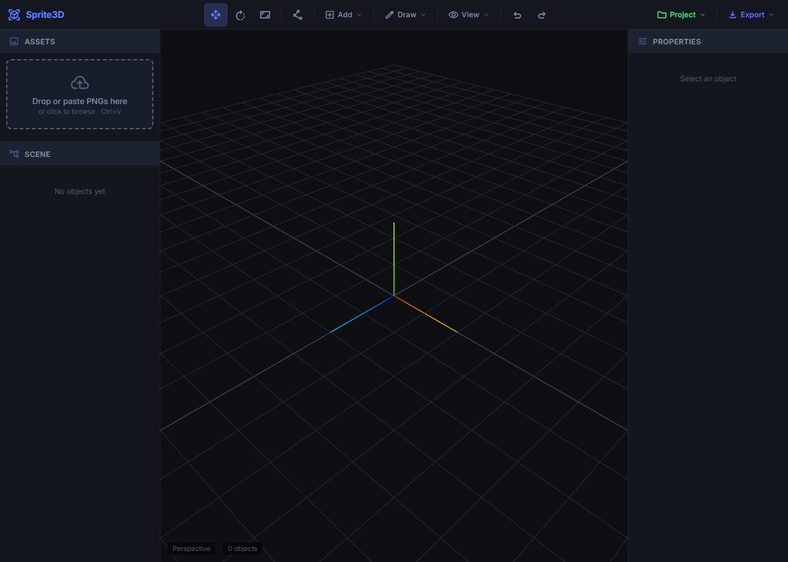
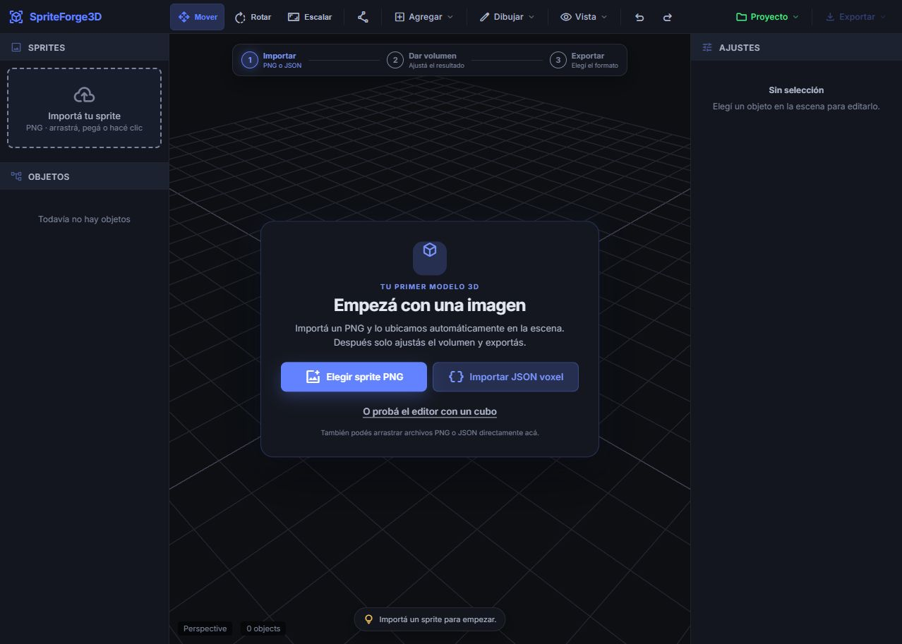
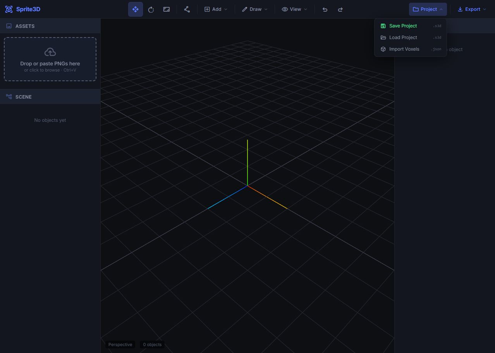
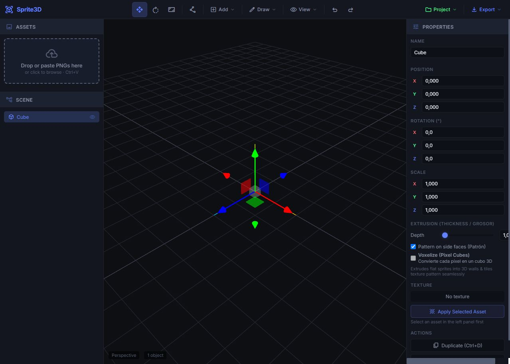
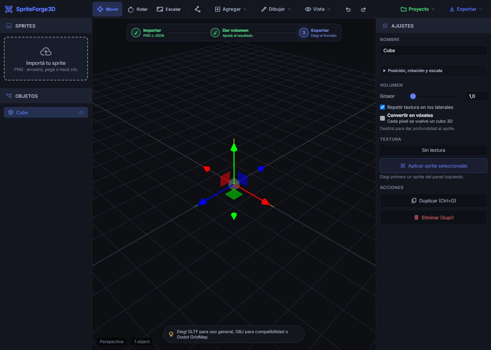
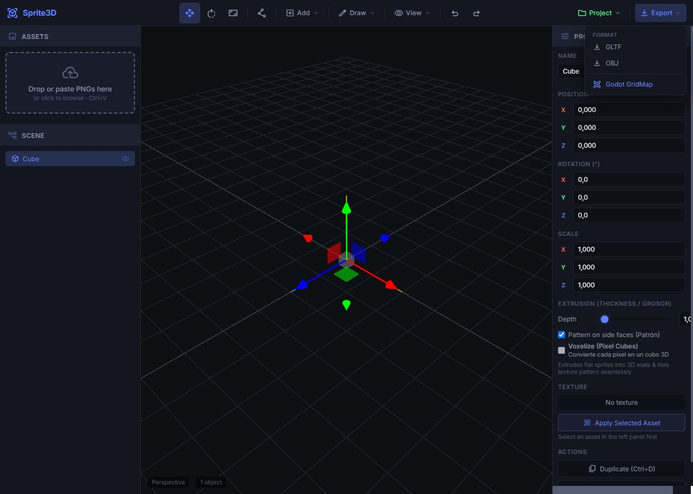
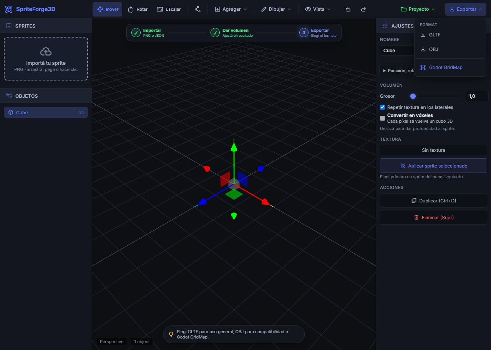

# Auditoría UX del editor SpriteForge3D

Fecha: 13 de agosto de 2026

## Alcance

Auditoría combinada de UX y accesibilidad del recorrido principal para una persona nueva: entrar al editor, incorporar contenido, editar el objeto y encontrar la exportación. La prioridad fue reducir clics y conocimiento previo necesario sin eliminar herramientas avanzadas.

## Objetivo del usuario

Convertir un sprite o archivo voxel en un objeto 3D editable y exportarlo sin tener que aprender primero la estructura completa del editor.

## Flujo auditado

1. **Entrada al editor — antes: débil / después: saludable.** La pantalla vacía original ofrecía una zona de carga lateral, pero el centro no explicaba el primer paso. La nueva entrada presenta una acción primaria, una alternativa voxel y un ejemplo inmediato.

   

   

2. **Incorporación de contenido — antes: mejorable / después: saludable.** El JSON estaba escondido dentro de Proyecto y el PNG requería cargar, seleccionar y colocar. Ahora ambos tipos tienen acceso directo; los PNG importados desde la entrada principal se colocan automáticamente en el centro.

   

3. **Edición — antes: sobrecargada / después: saludable.** Posición, rotación, escala, extrusión y textura competían al mismo nivel, con acciones importantes debajo del pliegue. Ahora Volumen queda visible y los valores técnicos se agrupan en un panel plegable.

   

   

4. **Exportación — antes: encontrable pero sin guía / después: saludable.** Los formatos aparecían sin explicación y Exportar estaba disponible incluso sin objetos. Ahora el flujo indica cuándo exportar, la acción se bloquea mientras no haya contenido y una ayuda contextual explica cada formato.

   

   

## Fortalezas confirmadas

- El lienzo 3D es dominante y conserva espacio suficiente para trabajar.
- Los grupos Proyecto y Exportar ya estaban separados y visualmente consistentes.
- La selección, el gizmo y la jerarquía se actualizan de forma inmediata.
- Los atajos existentes permiten acelerar el trabajo de usuarios expertos.

## Riesgos encontrados

- No existía una acción inicial dominante ni una explicación del recorrido.
- La importación dependía del tipo de archivo y estaba repartida entre dos superficies.
- Los tres iconos principales de transformación dependían de tooltips.
- El panel derecho exigía comprender coordenadas y terminología 3D antes de encontrar Volumen.
- Había mezcla de español e inglés en las acciones principales.
- Elementos clicables como la zona de carga y los objetos de escena no tenían operación completa por teclado.
- El texto secundario tenía contraste visual bajo sobre el fondo oscuro.

## Cambios aplicados

- Entrada guiada con una acción principal para PNG, acceso a JSON voxel y demo de un clic.
- Colocación automática del PNG importado en el centro del lienzo.
- Indicador persistente de tres pasos: Importar, Dar volumen y Exportar.
- Ayuda contextual que cambia con el estado real de la escena.
- Exportación deshabilitada hasta que exista contenido.
- Nombres visibles para Mover, Rotar y Escalar.
- Panel técnico de posición, rotación y escala plegado por defecto.
- Copy principal unificado en español y textos de ayuda más directos.
- Mayor contraste, objetivos de interacción más grandes y foco visible.
- Soporte de teclado para importar y seleccionar objetos de la jerarquía.

## Límites y verificación pendiente

Las capturas permiten evaluar jerarquía, claridad, densidad, estados y affordances visibles, pero no prueban cumplimiento WCAG completo ni comportamiento con lectores de pantalla. El flujo de demo, edición, panel avanzado y exportación fue recorrido en el navegador sin errores de consola. La carga real de un archivo local no pudo ejecutarse mediante la extensión de Chrome porque su acceso a archivos locales está deshabilitado; la lógica fue revisada en código y la compilación de producción finalizó correctamente.

## Recomendación siguiente

La siguiente mejora de mayor impacto sería aplicar la misma traducción y divulgación progresiva a Dibujar, Relieve voxel y Heightmap, validándola con una prueba breve de cinco usuarios que nunca hayan usado software 3D.
